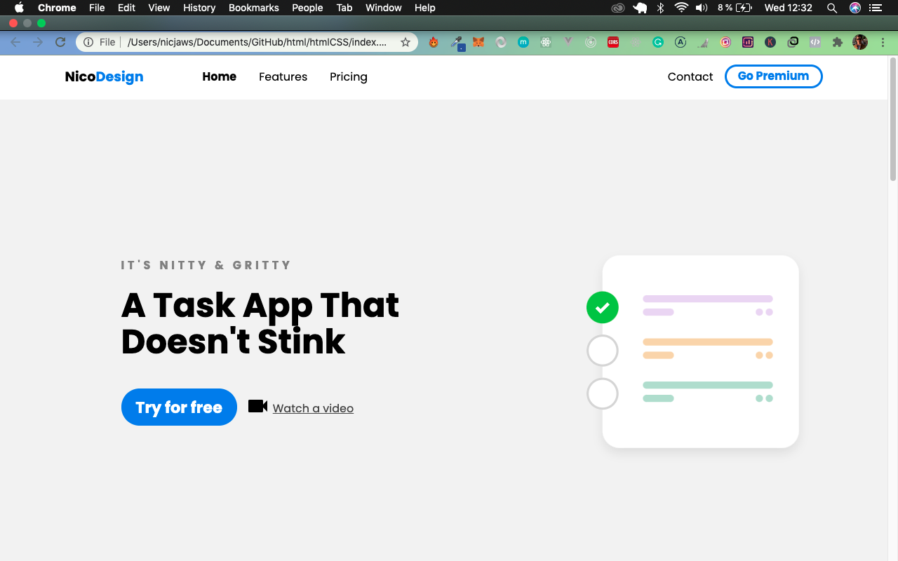
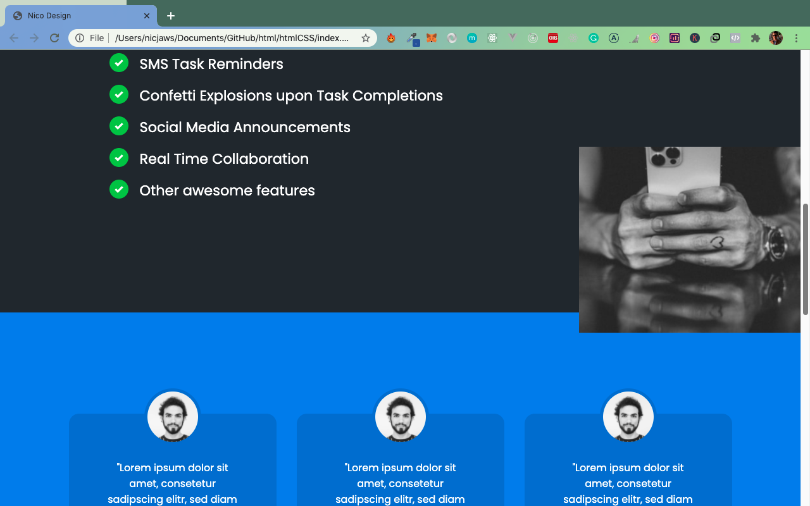
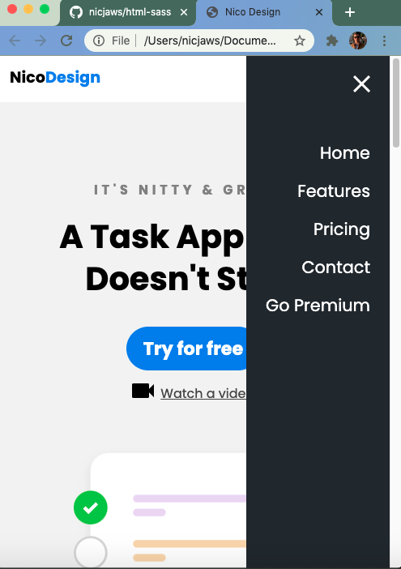

Responsive Website Project create with HTML and CSS (SASS) and a bit of javascript on the menu burger (no more functions added)

To test it, clone the repo or download it and click in the index.html file.

